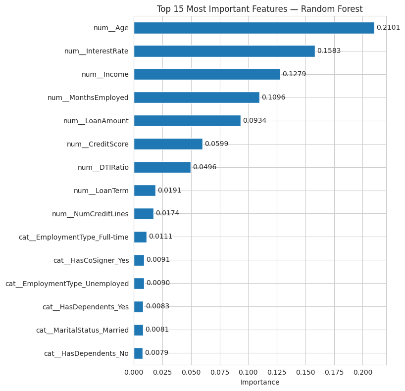
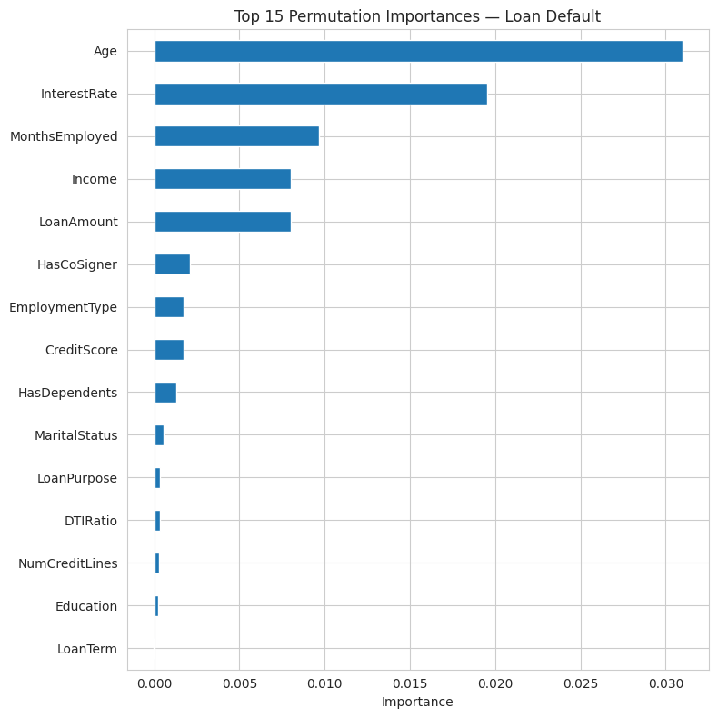
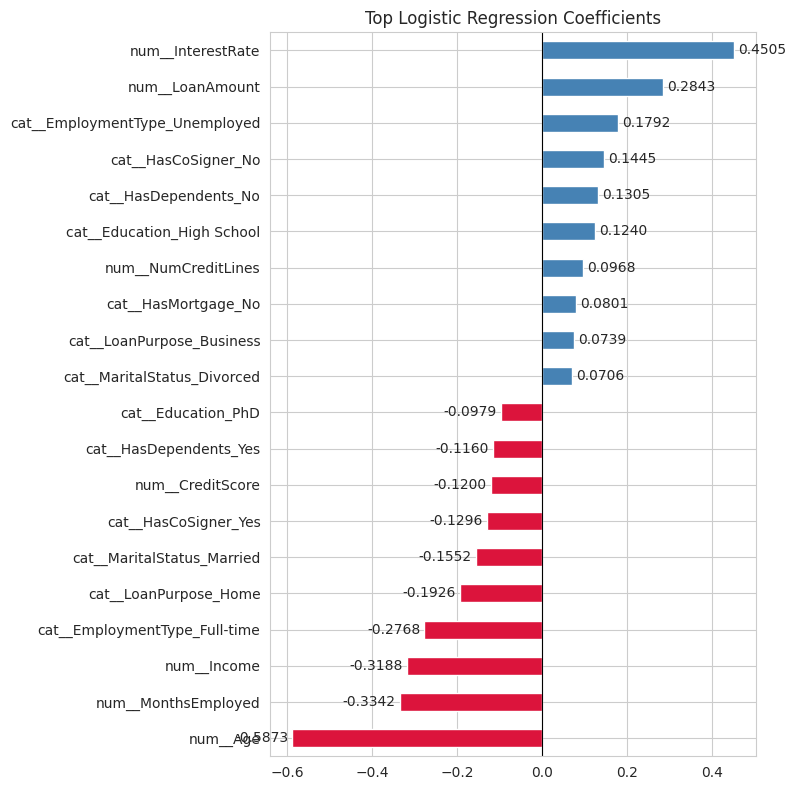

# 🏦 Loan Default Prediction
### Can we predict which customers will fail to repay their loans?


---

## 📌 Project Overview

Banks and financial institutions face significant risk when customers fail to repay their loans. This project builds a machine learning classification model to **predict loan defaults** based on customer financial and personal data — helping banks make smarter, data-driven lending decisions.

> **Business Goal:** Identify high-risk customers before approving loans to reduce financial losses.

---

## 📊 Dataset

| Property | Details |
|----------|---------|
| Source | [Kaggle — Loan Default Dataset](https://www.kaggle.com/datasets/nikhil1e9/loan-default) |
| Rows | 255,347 customers |
| Features | 16 (numeric + categorical) |
| Target | `Default` → 0 = Repaid ✅ / 1 = Defaulted ❌ |
| Class Balance | Imbalanced — 88.39% No Default / 11.61% Default |

---

## 🔍 Key Challenge — Imbalanced Classes

```
No Default (0): 225,694 customers  ████████████████████  88.39%
Default    (1):  29,653 customers  ██                    11.61%
```

A naive model predicting "No Default" for everyone achieves **88% accuracy** — but detects **0% of actual defaulters**. This project addresses this challenge using `class_weight='balanced'` and optimizing for **Recall** instead of Accuracy.

---

## 🛠️ Technical Stack

```python
Languages  : Python 3.10
Libraries  : Pandas, NumPy, Scikit-Learn, Seaborn, Matplotlib, Joblib
Environment: Google Colab
Workflow   : CRISP-DM
```

---

## 🔄 CRISP-DM Workflow

```
1. Business Understanding  →  Define the problem & success metric
2. Data Understanding      →  EDA, missing values, class balance
3. Data Preparation        →  Preprocessing pipeline (scaling + encoding)
4. Modeling                →  3 models × (default + tuned with GridSearchCV)
5. Evaluation              →  Classification report, confusion matrix, ROC/AUC
6. Model Interpretation    →  Feature importance, permutation importance, coefficients
7. Conclusion              →  Model recommendation with justification
```

---

## 📈 Models Built

| Model | Default Recall (1) | Tuned Recall (1) | AUC |
|-------|-------------------|-----------------|-----|
| Logistic Regression | 0.03 | **0.69** ✅ | **0.75** |
| Random Forest | 0.01 | 0.50 | 0.74 |
| KNN | 0.07 | 0.06 | 0.61 |

### Tuning Strategy
- **GridSearchCV** with `cv=3` and `scoring='recall_macro'`
- Tested: solver, penalty (L1/L2/Elasticnet), C values, class_weight
- Models saved with `joblib` to avoid re-training

---

## 🔎 Model Interpretation

### 1️⃣ Random Forest — Feature Importance



**Key Findings:**

| Rank | Feature | Importance | Insight |
|------|---------|------------|---------|
| 1 | **Age** | 0.2101 | Most influential — younger/older customers show distinct default patterns |
| 2 | **InterestRate** | 0.1583 | Higher interest rates strongly associated with default risk |
| 3 | **Income** | 0.1279 | Lower income customers are at higher risk |
| 4 | **MonthsEmployed** | 0.1096 | Employment stability plays a significant role |
| 5 | **LoanAmount** | 0.0934 | Larger loans carry higher default risk |

> The top 5 features are all **numerical** — Age, InterestRate, Income, MonthsEmployed, and LoanAmount account for over 70% of the model's predictive power.

---

### 2️⃣ Permutation Importance



**Key Findings:**

Permutation importance confirms the Random Forest results — when each feature is shuffled independently:

- **Age** causes the biggest performance drop (0.031) → most critical feature
- **InterestRate** follows closely (0.020) → second most critical
- **MonthsEmployed, Income, LoanAmount** are all important (0.008-0.010)
- **Categorical features** (HasCoSigner, EmploymentType, HasDependents) have measurable but smaller impact

> Both Feature Importance and Permutation Importance agree on the top predictors — giving us high confidence in these findings.

---

### 3️⃣ Logistic Regression — Coefficients



**Key Findings:**

**Increases Default Risk (Positive Coefficients):**
- 📈 **InterestRate** (+0.4505) — Strongest positive predictor. Higher rates = higher default risk
- 📈 **LoanAmount** (+0.2843) — Larger loans increase default probability
- 📈 **EmploymentType_Unemployed** (+0.1792) — Unemployed customers default significantly more
- 📈 **HasCoSigner_No** (+0.1445) — No co-signer = higher risk
- 📈 **HasDependents_No** (+0.1305) — Customers without dependents show higher default rates

**Decreases Default Risk (Negative Coefficients):**
- 📉 **Age** (-0.5873) — Older customers are significantly less likely to default
- 📉 **MonthsEmployed** (-0.3342) — Longer employment history = lower risk
- 📉 **Income** (-0.3188) — Higher income = lower default probability
- 📉 **EmploymentType_Full-time** (-0.2768) — Full-time employment strongly reduces risk
- 📉 **LoanPurpose_Home** (-0.1926) — Home loans have lower default rates

---

## 💡 Insights for Stakeholders

Based on model interpretation, here are the key recommendations:

1. **Age and Employment are the strongest risk signals** — Young customers with short employment history represent the highest-risk segment. Banks should require additional verification for this group.

2. **Interest Rate management is critical** — High-interest loans significantly increase default probability. Consider offering lower rates to customers with strong profiles to reduce overall default risk.

3. **Income verification is essential** — Income is the 3rd most important feature. Thorough income verification before approval can prevent a significant portion of defaults.

4. **Co-signer requirement for high-risk profiles** — Customers without a co-signer show higher default rates. Requiring co-signers for borderline applications could reduce losses.

5. **Loan Amount limits for high-risk customers** — LoanAmount is consistently in the top 5 features. Capping loan amounts for customers with risk factors could meaningfully reduce defaults.

---

## 🏆 Best Model — Logistic Regression

```
Recall (Default)    : 0.69  →  Detects 69% of actual defaulters
Recall (No Default) : 0.68
Macro Avg Recall    : 0.68
AUC                 : 0.75
Best Params         : penalty=elasticnet, solver=saga, class_weight=balanced
```

### Why Logistic Regression?
- ✅ Highest Recall for Default class (0.69)
- ✅ Highest AUC (0.75)
- ✅ Interpretable — banks can explain loan rejections using coefficients
- ✅ Fast training and prediction

---

## 📁 Project Structure

```
Loan-Default-Prediction/
│
├── Loan_default_project.ipynb   # Main notebook (full analysis)
├── README.md                    # Project documentation
├── images/                      # Visualizations
│   ├── feature_importance.png
│   ├── permutation_importance.png
│   └── lr_coefficients.png
└── data/
    └── Loan_default.csv         # Dataset (from Kaggle)
```

---

## 🚀 How to Run

```python
# 1. Clone the repository
git clone https://github.com/dohaalnabahin/Loan-Default-Prediction.git

# 2. Open in Google Colab or Jupyter Notebook

# 3. Install requirements
pip install pandas numpy scikit-learn seaborn matplotlib joblib imbalanced-learn

# 4. Run all cells in order
```

---

## 💡 Key Learnings

- Accuracy is **misleading** with imbalanced datasets → always check Recall
- `class_weight='balanced'` dramatically improves minority class detection
- Logistic Regression can outperform complex models on financial tabular data
- Feature Importance + Permutation Importance together give more reliable insights
- Saving models with `joblib` saves hours of re-training time

---

## 📬 Connect

**Doha Al-Nabahin**

[](https://linkedin.com/in/doha-samir12)
[](https://github.com/dohaalnabahin)

---

*Loan Default Prediction using Machine Learning | April 2026*
